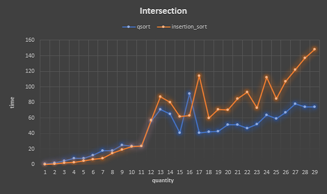
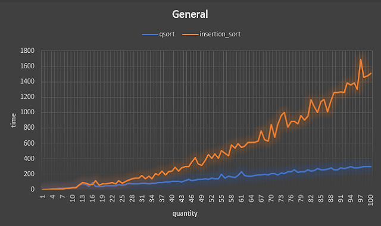

# lab 3: Sort()
## Task
Task is to develop a generalized sort() function, that implements a fast sorting algorithm with the following optimizations:
- Selection of the pivot element as the median of the first, middle, and last elements of the sorted interval;
- Exclusion of the tail recursion: The function should determine the lengths of the resulting intervals after division, and recursively sort the interval of smaller length, iteratively processing interval of greater length;
- Use of the algorithm of sorting by inserts for short intervals ;
- Use move-semantics to exchange elements in the process of partitioning and in insertion sorting;

## Charts
#### Intersection

- Shows point of intersection at 11 elements;

#### General

- General difference between these sorting algorithms;

